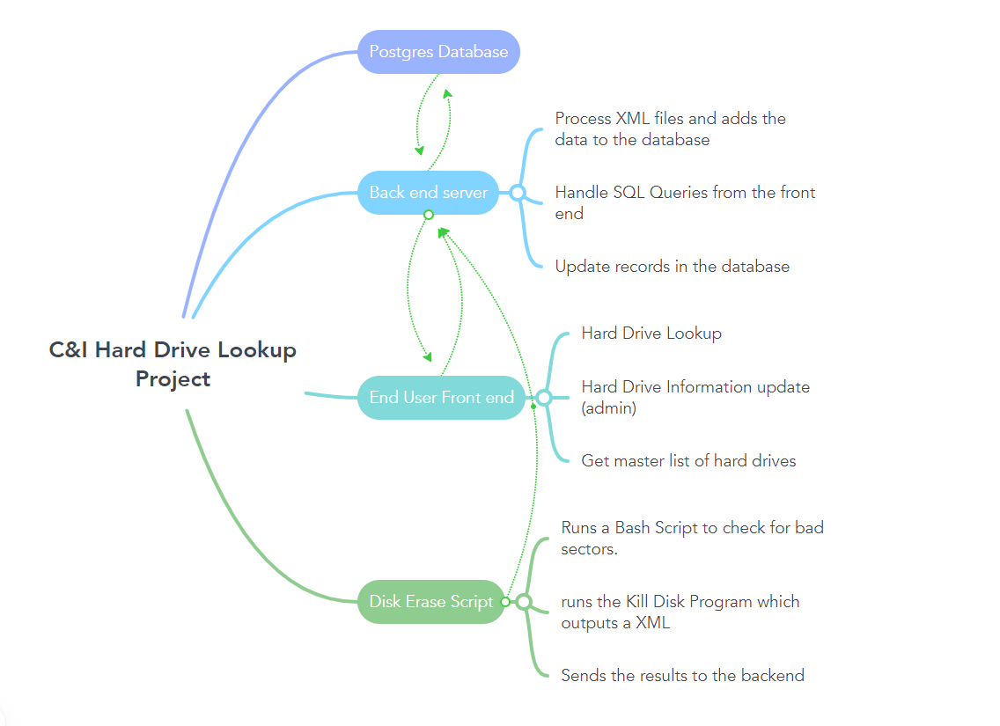

# C & I HARD DRIVE TRACKING AND AUTOMATION

----

----

## Process Steps

1) Receipt of hard drive on dock
2) From there the hard drive is sent to "SORTING"
3) It is then serialized and put into "RazorERP"
4) It is then sent to the tech room for testing
5) TESTING
    1) The hard drive is checked for bad sectors and if they are detected it is labeled as having a bad_sector and failed
    2) If there are no bad sectors found on the hard drive, The serial information of the hard drive is put into a variable.
6) Data Sanitization
    1) The hard drive is attached to the Disc Sanitization Machine.
    2) Once the machine is finished with the Sanitization, It will output an XML file.
7) Data Parsing
    1) Data from the XML file is parsed into a useful format and associated with the serial number from the previous step.
8) Send to database.
    1) Data both parsed and raw is stored in a SQL database, that can be accessed by the front end for ease of access

----

----

# Proposed Systems

----

* Web Based GUI Front End to easily access documents and search through records.
* SQL database for long term retention of records
* Bash Script that triggers the wiping of drives, scans for bad sectors, and gets identifier information from the hard drive

----

## User Story

---
The end user wants to try to automate the departments work flow, with hard drives
to reduce human error with maintaining records. It will also help with standardization in the department
allowing less specialized employees to share the workload. The process should allow for minimal human input
to reduce points of failure.

----

## Proposed Workflow

----

Begin by building a SQL database. Once the database is built we need to figure out
how to automate KILL-DISC from the command line. Once we figure that out we need to figure out
how to talk to razors API to get Drive info from when the drive was received.
We then need to figure out how to get the bad_sector Script to fit in.
Then we need to get the output from kill disc and parse it.
finally we need to save the output XML file, The certificate of sanitization, as well as the parsed data
to a database for retention as well as searching by the end user.

The front end of the application should have a search input field that allows the end user to search
the front end will then use the appropriate SQL queries and display the information. Some data will be prioritized
being shown but if the user scrolls all data will eventually be shown

* database
* kill-disc
* RazorERP
* bad_sector script
* parse_XML

## database fields

----

## links

---- 

[RazorERP documentation ](https://apiprod.razorerp.com/swagger/index.html#/)

[Kill Disk Manual](https://www.killdisk.com/manual/index.html)

[Kill Disk XML output customazation](https://www.killdisk.com/manual/index.html#options-reports.html)